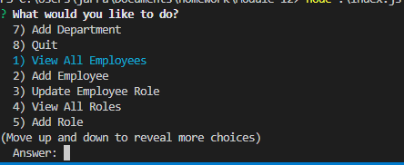

** Description

This is my company manager SQL Server database manager. Using inquirer and console.table you can view your employees, roles and departments. The program also allows you to update said tables in the program via inquirer

**Installation

Clone repo and then
Create a .env file with data in config and run npi i to download all dependencies needed.

**Usage

Must have working server with database running sql and run node index.js for inquirer manager

https://github.com/zelada5574/employeetracker